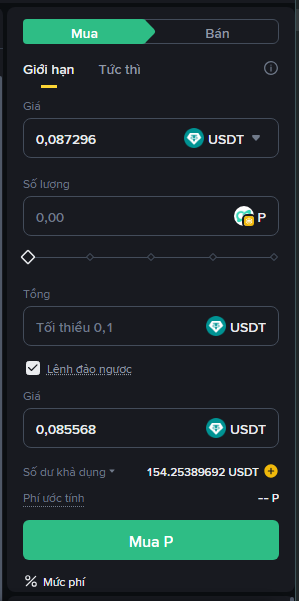

# Binance Alpha Auto Trade Plow Poin

## 🧠 Overview  
**Binance Alpha Auto Trade** is an automation script designed to **accumulate Alpha points** through continuous trading activity on **Binance Alpha**.  
It automatically executes **buy/sell orders repeatedly**, eliminating the need for manual trading and maximizing point farming efficiency.

---

## ⚙️ Default Configuration  
The default parameters are optimized for safety and stable performance:
- `amount = 50` → Each order trades 50 USDT  
- `maxCostFee = 2` → Stops if total fees exceed 2 USDT  
- `maxTotalAmount = 16500` → Total trading volume target: 16,500 USDT (≈16 Alpha points, assuming 4× point multiplier coin)  
- `customize = 0.01` → Max price slippage of 1%  

👉 **Recommended:**  
- Keep these values unchanged for best performance.  
- Choose **high-volume coins** and those offering **x4 Alpha points**.

---

## 💡 How to Use  
1. Make sure the Binance Alpha trading interface displays all necessary input fields:  
   - **Limit Price** (`limitPrice`)  
   - **Total** (`limitTotal`)  
   - And the **“Reverse Order”** checkbox is enabled. 

   

2. Open the **Binance Alpha** trading page (Spot).  
3. Press **F12** to open the browser **Console**.  
4. **Copy and paste** the full script into the Console, then press **Enter** to start.

---

## ▶️ Run & Stop  
- **Start trading:**  
  ```js
  startTrade();
  ```
- **Stop trading manually:**  
  ```js
  stopTrade();
  ```
- If the script stops unexpectedly:  
  - You can **refresh the page (F5)**, then re-paste the full code and run `startTrade()` again.  
  - Or simply re-run `startTrade()` without refreshing.

---

## ⚠️ Notes  
- This script **does not guarantee profits** — it’s designed purely for **Alpha point farming** by increasing your trading volume.  
- **Avoid changing configuration parameters** unless you fully understand their impact.  
- Run the script during stable market conditions to prevent slippage or exchange lag.
